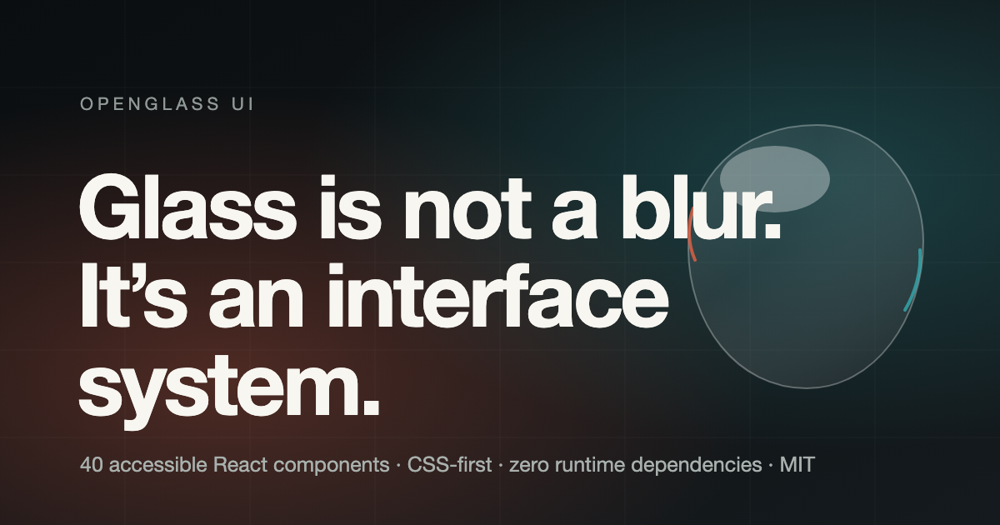

<p align="center">
  
</p>

<h1 align="center">OpenGlass UI</h1>

<p align="center">
  <strong>The open-source Liquid Glass UI system for React and the web.</strong>
</p>

<p align="center">
  <a href="https://www.npmjs.com/package/open-glass-ui"></a>
  <a href="./LICENSE"></a>
  <a href="https://www.npmjs.com/package/open-glass-ui?activeTab=dependencies"></a>
  <a href="https://github.com/moekoelueker/open-glass-ui/actions/workflows/ci.yml"></a>
</p>

Forty accessible React components on a CSS-first glass material, with adaptive
light and dark themes, customizable accents, and opt-in refraction for media you
own. Text, focus, and keyboard behavior stay native DOM.

```sh
npm install open-glass-ui react react-dom
```

```tsx
import "open-glass-ui/styles.css";
import { Button, Glass, GlassSystemProvider } from "open-glass-ui";

export function App() {
  return (
    <GlassSystemProvider renderer="auto" theme={{ appearance: "system" }}>
      <Glass material="frosted">
        <Button variant="primary">Create project</Button>
      </Glass>
    </GlassSystemProvider>
  );
}
```

## Why this exists

Most web "liquid glass" is a blur and a border. The rest are single-effect demos
that fall apart the moment real text, focus rings, or a screen reader arrive.
OpenGlass UI is built the other way around: the material serves a component
system, not the reverse.

- **One package, zero runtime dependencies.** React and React DOM are peers.
- **CSS-first.** `renderer="auto"` never silently escalates to something
  expensive. SVG/SDF is an explicit enhancement; WebGL is an explicit opt-in for
  image, canvas, or video sources you control.
- **Accessible by construction.** Reduced motion, reduced transparency, and
  forced colors are designed states that still look intentional.
- **SSR and RSC safe.** A server-safe `core` entry never imports React.
- **Tree-shakes.** Importing one component costs 23% of the full barrel.

## What it does not claim

The project says physics-*inspired*, not physically accurate. CSS implies
refraction rather than performing true arbitrary-DOM refraction; browsers cannot
generally sample arbitrary page pixels. WebGL has the highest optical ceiling
but only over media you own. Full detail in
[docs/LIMITATIONS.md](./docs/LIMITATIONS.md).

OpenGlass UI is independent and is not affiliated with, endorsed by, or
sponsored by Apple Inc.

## Documentation

| | |
| --- | --- |
| [Components](./docs/COMPONENTS.md) | All forty components and their props |
| [Theming](./docs/THEMING.md) | Tokens, presets, custom accents |
| [Renderers](./docs/RENDERERS.md) | How CSS, SVG, and WebGL get chosen |
| [Architecture](./docs/ARCHITECTURE.md) | How the system fits together |
| [Accessibility](./docs/ACCESSIBILITY.md) | Keyboard, ARIA, preference handling |
| [Browser support](./docs/BROWSER-SUPPORT.md) | Baselines and fallbacks |
| [AI-agent usage](./docs/AI-USAGE.md) | Guidance for coding agents |
| [Performance](./docs/PERFORMANCE.md) | Measurements and budgets |
| [Validation](./docs/VALIDATION.md) | What is tested, and how |
| [Migration](./docs/MIGRATION.md) | Moving from a hand-rolled glass layer |
| [Limitations](./docs/LIMITATIONS.md) | What this does not do |
| [Changelog](./CHANGELOG.md) | Release history |

Machine-readable references for coding agents live at
[`llms.txt`](./llms.txt) and [`llms-full.txt`](./llms-full.txt).

## The research behind it

Five materially different rendering approaches were built and compared under the
same interaction and difficult-background suite, then scored with visual appeal
weighted at 50%:

| Rank | Approach | Score | Role in the product |
| ---: | --- | ---: | --- |
| 1 | Adaptive Hybrid | 9.36 | The architecture |
| 2 | Native CSS | 9.25 | The default material |
| 3 | Spectral WebGL | 8.66 | Opt-in, owned media only |
| 4 | Organic SVG | 8.60 | Expressive recipe |
| 5 | Geometric SDF | 8.59 | Deterministic adapter |

The write-ups are in [docs/RESEARCH.md](./docs/RESEARCH.md),
[docs/EXPERIMENT-REPORT.md](./docs/EXPERIMENT-REPORT.md), and
[docs/COMPONENT-ATLAS.md](./docs/COMPONENT-ATLAS.md). Every experiment is still
browsable in the showcase under `/research`, `/library`, and `/experiments/*`.

## Contributing

Contributions are welcome. See [CONTRIBUTING.md](./CONTRIBUTING.md) for the
workflow, [CODE_OF_CONDUCT.md](./CODE_OF_CONDUCT.md) for expectations, and
[SECURITY.md](./SECURITY.md) for reporting vulnerabilities.

```sh
pnpm install
pnpm dev            # showcase at http://127.0.0.1:4173
pnpm run check      # lint and format
pnpm run typecheck
pnpm run test:unit
pnpm run test:e2e   # browser suite, serialized
```

`pnpm run release:check` runs the complete publish-blocking gate.

Maintainers and AI workspaces picking up in-flight work should start with
[HANDOVER.md](./HANDOVER.md) and the [context pack](./context/README.md).

## Repository layout

```text
packages/ui         the published open-glass-ui package
packages/core       framework-independent optics, geometry, theme math
packages/renderers  CSS, SVG, and WebGL2 capability and rendering
packages/react      SSR-safe React primitives and capability policy
packages/recipes    the forty accessible components and their CSS
apps/showcase       landing page, catalog, docs, research routes
examples/next       Next.js RSC and static-build fixture
examples/react18    React 18 compatibility fixture
tests               workspace and browser validation
```

Only `packages/ui` is published. The `@open-glass-ui/*` packages are private
build-time boundaries whose code and declarations are inlined into it, which is
why the published package has no runtime dependencies. Do not import them
directly; they do not exist on npm.

## License

[MIT](./LICENSE).
