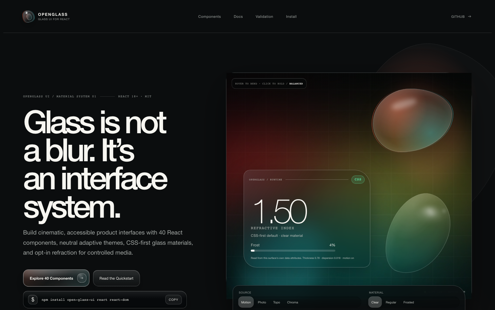
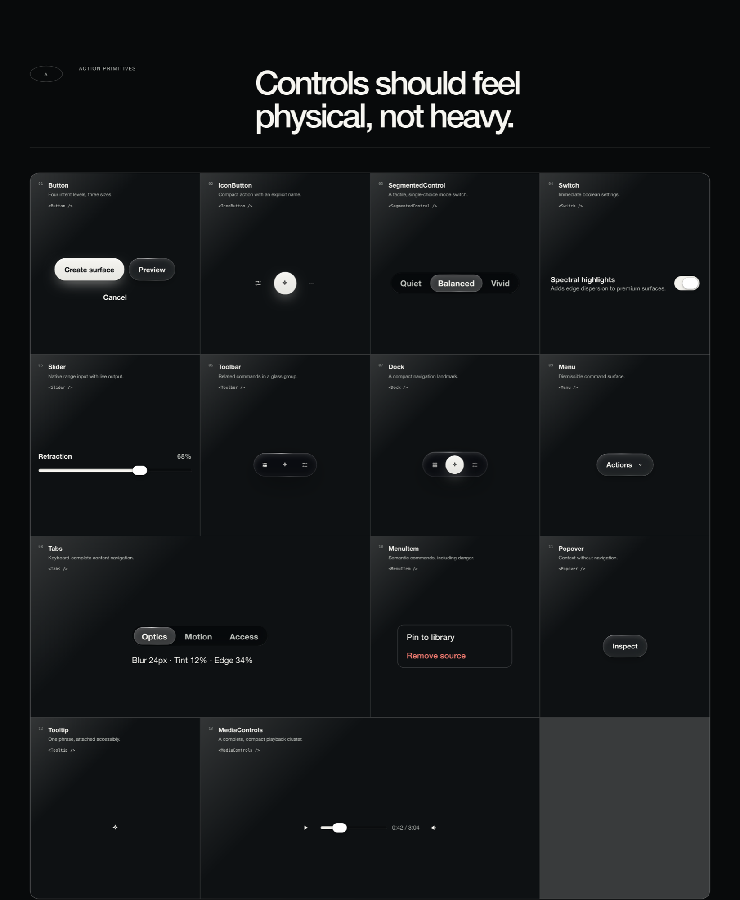
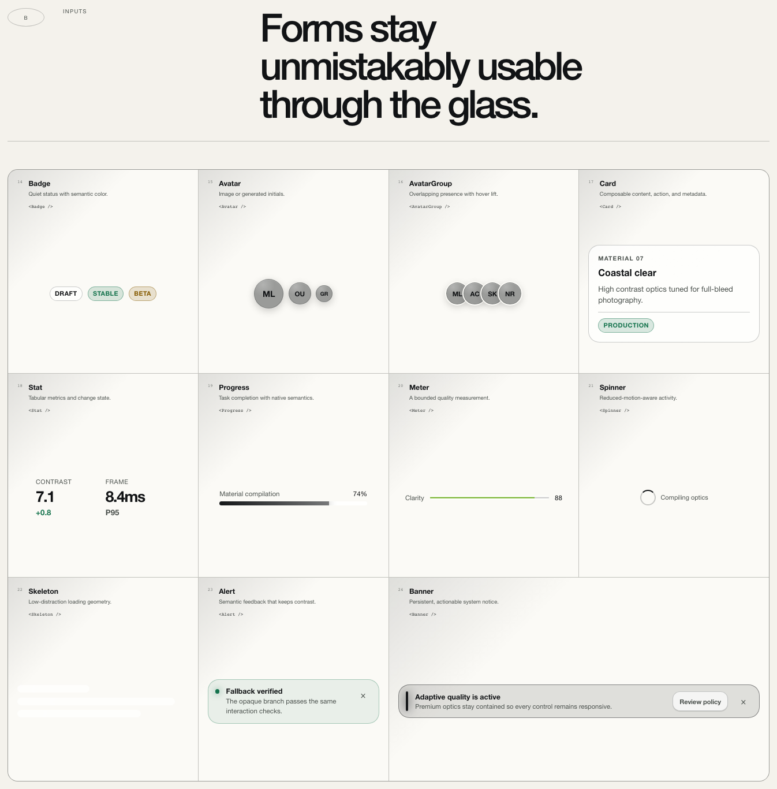
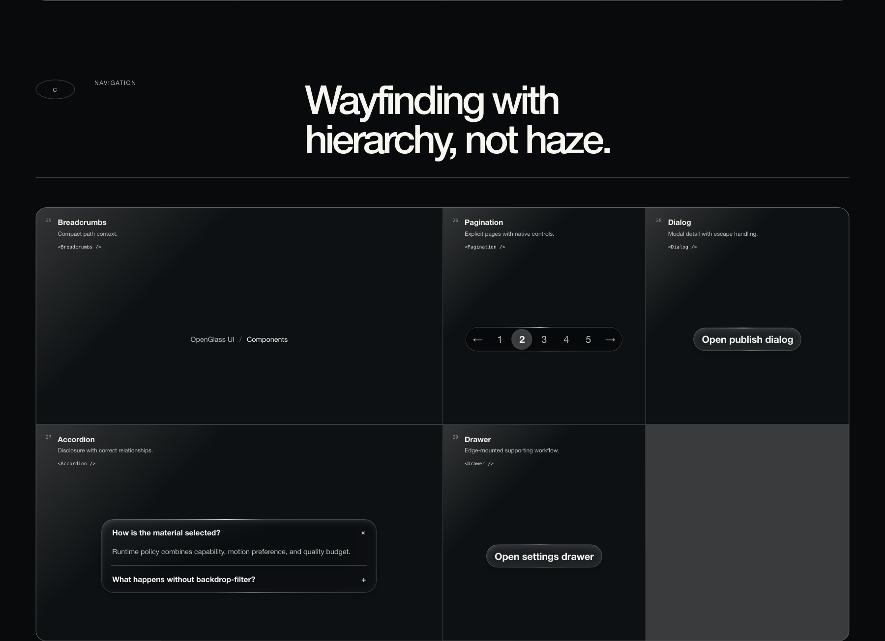
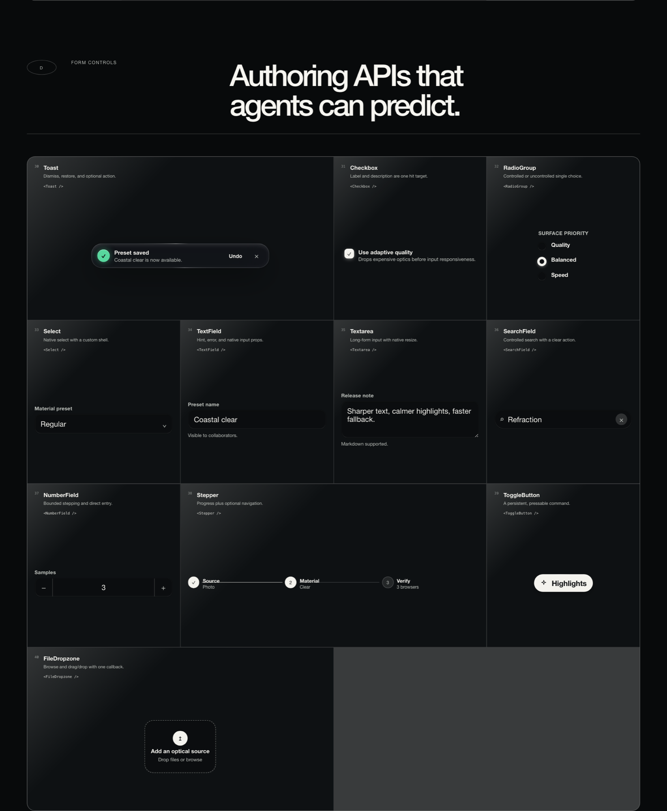
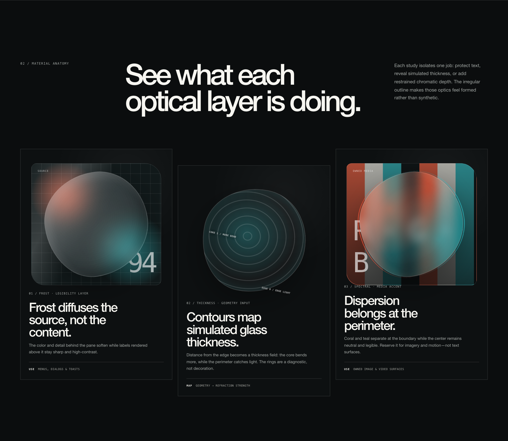
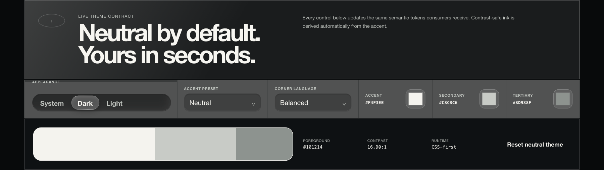

<p align="center">
  
</p>

<h1 align="center">OpenGlass UI</h1>

<p align="center">
  <strong>The open-source Liquid Glass UI system for React and the web.</strong>
</p>

<p align="center">
  <a href="https://www.npmjs.com/package/open-glass-ui"></a>
  <a href="./LICENSE"></a>
  <a href="https://www.npmjs.com/package/open-glass-ui?activeTab=dependencies"></a>
  <a href="https://github.com/moekoelueker/open-glass-ui/actions/workflows/ci.yml"></a>
</p>

<p align="center">
  <a href="https://moelueker.com/liquid-glass"><strong>Live demo and docs →</strong></a>
</p>

<p align="center">
  <a href="https://moelueker.gumroad.com/l/openglass">Free download</a> ·
  <a href="https://youtu.be/KYcqUP9vJfo">Watch the build</a> ·
  <a href="https://moelueker.com">moelueker.com</a>
</p>

---

Most "liquid glass" on the web is a blur with a border. The few that go further
are one-off effects that fall apart the moment real text, a focus ring, or a
screen reader shows up.

OpenGlass UI is built the other way around: **forty accessible components that
happen to be made of glass**, not a glass effect with components bolted on. The
material serves the component system, never the reverse.

```sh
npm install open-glass-ui react react-dom
```

```tsx
import "open-glass-ui/styles.css";
import { Button, Glass, GlassSystemProvider } from "open-glass-ui";

export function App() {
  return (
    <GlassSystemProvider renderer="auto" theme={{ appearance: "system" }}>
      <Glass material="frosted">
        <Button variant="primary">Create project</Button>
      </Glass>
    </GlassSystemProvider>
  );
}
```

That is the whole setup. One package, one stylesheet, one provider.

## Why you might pick this

|  |  |
| --- | --- |
| **Zero runtime dependencies** | The published package depends on nothing. React and React DOM are peers, so your app owns its versions. |
| **One import, not forty** | Importing a single component costs 23% of the full barrel. The other thirty-nine are shaken out. |
| **CSS-first, no surprises** | `renderer="auto"` resolves to plain CSS and never silently escalates. SVG refraction and WebGL are opt-in. |
| **Accessible by construction** | Reduced motion, reduced transparency, and forced colors are designed states, not afterthoughts. |
| **SSR and RSC safe** | A server-safe `open-glass-ui/core` entry never imports React. Verified against Next.js 16. |
| **Tested where it matters** | 105 unit tests and 161 browser checks across Chromium, Firefox, and WebKit. |

## The forty components

Every specimen below is live in the [component catalog](https://moelueker.com/liquid-glass#components).
They are ordinary DOM: they take focus, respond to the keyboard, and announce
themselves properly.

### Actions and controls

`Button` `IconButton` `SegmentedControl` `Switch` `Slider` `Toolbar` `Dock`
`Tabs` `Menu` `MenuItem` `Popover` `Tooltip` `MediaControls`



### Data display and status

`Badge` `Avatar` `AvatarGroup` `Card` `Stat` `Progress` `Meter` `Spinner`
`Skeleton` `Alert` `Banner`



### Navigation and overlays

`Breadcrumbs` `Pagination` `Accordion` `Dialog` `Drawer`



### Forms and input

`TextField` `Textarea` `NumberField` `SearchField` `Select` `Checkbox`
`RadioGroup` `Stepper` `ToggleButton` `FileDropzone` `Toast`



Full props for each: [docs/COMPONENTS.md](./docs/COMPONENTS.md).

## Three materials, one contract



Glass is a hierarchy tool, not decoration. Each material has a job:

| Material | Refractive index | Frost | Use it for |
| --- | ---: | ---: | --- |
| `clear` | 1.50 | 4% | Hero surfaces and lenses over imagery |
| `regular` | 1.46 | 24% | The default. Cards, panels, most surfaces |
| `frosted` | 1.40 | 66% | Menus, dialogs and toasts over busy content |

```tsx
<Glass material="frosted">…</Glass>
```

## Theming



Neutral light and dark are the defaults and need no configuration. Accent,
secondary, and tertiary colors are yours. Foreground ink is derived
automatically so contrast stays safe, whatever accent you pick.

```tsx
<GlassSystemProvider
  theme={{
    appearance: "system",
    theme: { preset: "cobalt", contrast: "high", radius: "balanced" },
  }}
>
  <App />
</GlassSystemProvider>
```

Six presets ship in the box, or pass any hex. Every token is a `--ogui-*` custom
property you can override. See [docs/THEMING.md](./docs/THEMING.md).

## Accessibility is not a checkbox here

A survey of notable web glass libraries found **zero** implementing
`prefers-reduced-transparency` or `prefers-contrast`. This one treats them as
designed states that still look intentional:

- **Reduced motion** stops pointer tracking, morphing, and background video.
- **Reduced transparency** swaps to opaque surfaces with equivalent hierarchy.
- **Forced colors** hands rendering to the system palette instead of fighting it.
- **Text never gets flattened into a canvas.** Selection, focus, and screen
  reader semantics survive because the DOM survives.

Details in [docs/ACCESSIBILITY.md](./docs/ACCESSIBILITY.md).

## What this does not claim

The project says physics-*inspired*, not physically accurate. Browsers cannot
generally sample arbitrary page pixels, so CSS **implies** refraction rather
than performing it. WebGL has the highest optical ceiling but only over media
you own. SVG displacement is real but browser-sensitive.

Those limits are the reason the architecture looks the way it does. Full list:
[docs/LIMITATIONS.md](./docs/LIMITATIONS.md).

OpenGlass UI is independent and is not affiliated with, endorsed by, or
sponsored by Apple Inc.

## Documentation

| | |
| --- | --- |
| [Components](./docs/COMPONENTS.md) | All forty components and their props |
| [Theming](./docs/THEMING.md) | Tokens, presets, custom accents |
| [Renderers](./docs/RENDERERS.md) | How CSS, SVG, and WebGL get chosen |
| [Architecture](./docs/ARCHITECTURE.md) | How the system fits together |
| [Accessibility](./docs/ACCESSIBILITY.md) | Keyboard, ARIA, preference handling |
| [Browser support](./docs/BROWSER-SUPPORT.md) | Baselines and fallbacks |
| [AI-agent usage](./docs/AI-USAGE.md) | Guidance for coding agents |
| [Performance](./docs/PERFORMANCE.md) | Measurements and budgets |
| [Validation](./docs/VALIDATION.md) | What is tested, and how |
| [Migration](./docs/MIGRATION.md) | Moving from a hand-rolled glass layer |
| [Limitations](./docs/LIMITATIONS.md) | What this does not do |
| [Changelog](./CHANGELOG.md) | Release history |

Machine-readable references for coding agents: [`llms.txt`](./llms.txt) and
[`llms-full.txt`](./llms-full.txt).

## The research behind it

Five materially different rendering approaches were built and compared under the
same interaction and difficult-background suite, then scored with visual appeal
weighted at 50%:

| Rank | Approach | Score | Role in the product |
| ---: | --- | ---: | --- |
| 1 | Adaptive Hybrid | 9.36 | The architecture |
| 2 | Native CSS | 9.25 | The default material |
| 3 | Spectral WebGL | 8.66 | Opt-in, owned media only |
| 4 | Organic SVG | 8.60 | Expressive recipe |
| 5 | Geometric SDF | 8.59 | Deterministic adapter |

The shader had the highest ceiling but only works on media you own. CSS won on
everything else, so CSS became the default and the rest became opt-in.

Write-ups: [docs/RESEARCH.md](./docs/RESEARCH.md),
[docs/EXPERIMENT-REPORT.md](./docs/EXPERIMENT-REPORT.md),
[docs/COMPONENT-ATLAS.md](./docs/COMPONENT-ATLAS.md). Every experiment is still
browsable locally under `/research`, `/library`, and `/experiments/*`.

## Contributing

Contributions are welcome, and pre-`1.0` is a good time to influence the API.
See [CONTRIBUTING.md](./CONTRIBUTING.md) for what reviewers look for,
[CODE_OF_CONDUCT.md](./CODE_OF_CONDUCT.md), and [SECURITY.md](./SECURITY.md).

```sh
pnpm install
pnpm dev            # showcase at http://127.0.0.1:4173
pnpm run check      # lint and format
pnpm run typecheck
pnpm run test:unit
pnpm run test:e2e   # browser suite, serialized
```

`pnpm run release:check` runs the complete publish-blocking gate.

Maintainers picking up in-flight work should start with [HANDOVER.md](./HANDOVER.md)
and the [context pack](./context/README.md).

## Repository layout

```text
packages/ui         the published open-glass-ui package
packages/core       framework-independent optics, geometry, theme math
packages/renderers  CSS, SVG, and WebGL2 capability and rendering
packages/react      SSR-safe React primitives and capability policy
packages/recipes    the forty accessible components and their CSS
apps/showcase       landing page, catalog, docs, research routes
examples/next       Next.js RSC and static-build fixture
examples/react18    React 18 compatibility fixture
tests               workspace and browser validation
```

Only `packages/ui` is published. The `@open-glass-ui/*` packages are private
build-time boundaries whose code and declarations are inlined into it, which is
why the published package has no runtime dependencies. Do not import them
directly; they do not exist on npm.

## Built by

OpenGlass UI is built and maintained by [Moe Lueker](https://moelueker.com). See
it live at [moelueker.com/liquid-glass](https://moelueker.com/liquid-glass), watch
the [build-and-deploy walkthrough](https://youtu.be/KYcqUP9vJfo), or grab the
[free download on Gumroad](https://moelueker.gumroad.com/l/openglass) (it includes
a copy-paste skill so coding agents build with the library correctly).

## License

[MIT](./LICENSE).
